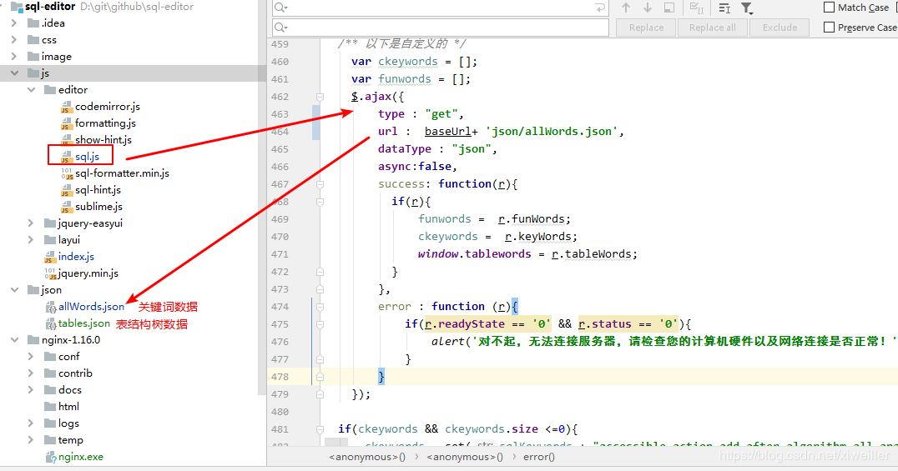
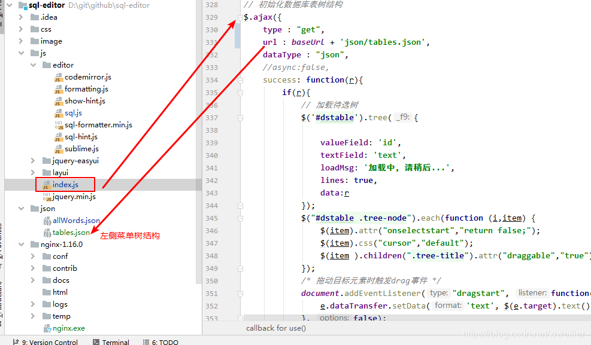
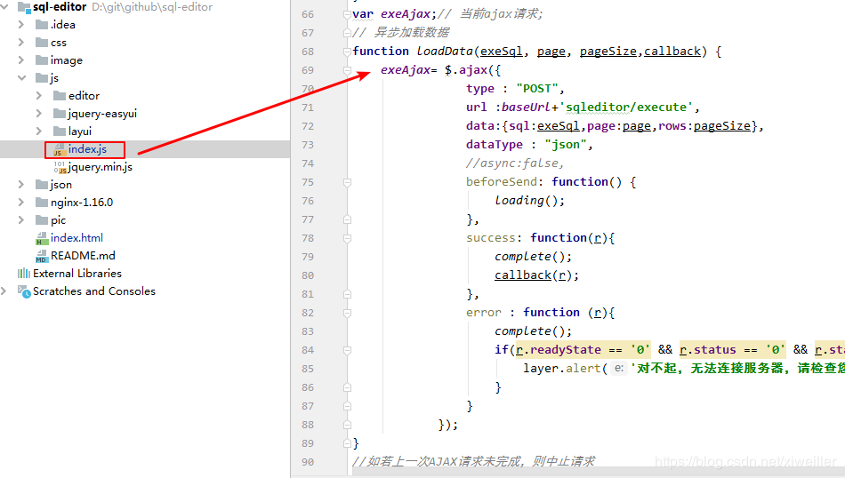
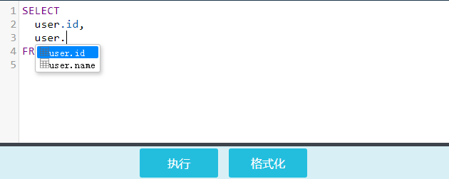

# sql-editor

>sql-editor是基于CodeMirror的一个在线sql编辑工具，模仿navicat工具，开发的一个简易版。

    目前只提供前端代码，测试数据为json模拟数据,为本地Nginx代理提供。
### 启动步骤：
1.启动nginx代理，进入目录 ./nginx-1.16.0/，打开命令行工具，执行一下命令：
```
 #启动
 start ./nginx.exe 
 #停止
 ./nginx.exe -s stop
```
2.浏览器访问。地址：http://localhost:8080/sql-editor/index.html

### 涉及接口
1. 关键词接口 (./js/editor/sql.js)

2. 左侧表，树结构接口 (./js/index.js)

3. sql 执行查询接口（./js/index.js，不提供后台实现，使用者可自定义）

### 功能更新
   - 左侧提供数据库表字段树形结构，可拖拽到sql编辑框。(2019-7-19新增)
   - 编辑区和数据展示区上下拖动更改大小。(2019-7-19新增)
   - 执行与中断功能。(2019-7-19新增)
   - 自定义外部接口获取sql关键词、函数、表字段等，用于sql编辑时提示补全,键盘录入后自动提示，上下键选择，tab键或点击选中项自动补全。(2019-7-16)
   - sql格式化。(2019-7-16)

### 一些截图：




